# Azure Terraform Platform

A production-grade, reusable Terraform platform for provisioning Azure networking, RBAC, compute, and AKS (Azure Kubernetes Service) using **Terraform workspaces** for environment isolation.

## 🎯 Design Principles

- **Single Codebase**: One set of modules serves all environments (dev, stage, prod)
- **Workspace-Driven**: Terraform workspaces provide state isolation, not logic branching
- **Module Reusability**: All modules are environment-agnostic
- **Zero Hardcoding**: No environment names in module code
- **State Isolation**: Each workspace has a separate remote state file
- **Production-Ready**: CI/CD-safe, GitHub-ready, review-clean

## 📁 Project Structure

```
azure-terraform-platform/
├── modules/                    # Reusable, environment-agnostic modules
│   ├── network/               # VNet and subnets
│   │   ├── main.tf
│   │   ├── variables.tf
│   │   └── outputs.tf
│   ├── rbac/                  # Azure RBAC role assignments
│   │   ├── main.tf
│   │   ├── variables.tf
│   │   └── outputs.tf
│   ├── compute/               # VM Scale Sets with managed identities
│   │   ├── main.tf
│   │   ├── variables.tf
│   │   └── outputs.tf
│   └── aks/                   # Azure Kubernetes Service
│       ├── main.tf
│       ├── variables.tf
│       └── outputs.tf
│
├── environments/
│   └── root/                  # Root orchestration layer (EXECUTE FROM HERE)
│       ├── main.tf            # Module composition with workspace config
│       ├── variables.tf       # Input variables
│       └── outputs.tf         # Aggregated outputs
│
├── backend.tf                 # Remote state configuration
├── providers.tf               # Azure provider setup
├── .gitignore                 # Excludes .terraform/, *.tfstate, *.tfvars
├── terraform.tfvars.example   # Example configuration file
├── backend.hcl.example        # Example backend configuration
└── README.md
```

## 📊 Visual Architecture

### System Overview


### Module Dependencies & Data Flow

```mermaid
graph LR
    subgraph "Root Orchestration"
        ROOT[environments/root/main.tf<br/>Workspace Config Selector]
    end
    
    subgraph "Module Execution Order"
        ROOT -->|1. Creates| NET[Network Module<br/>├─ Resource Group<br/>├─ VNet<br/>├─ AKS Subnet<br/>└─ Compute Subnet]
        
        NET -->|2. Outputs: subnet_ids| COMP[Compute Module<br/>├─ Managed Identity<br/>└─ VM Scale Set]
        
        NET -->|3. Outputs: aks_subnet_id| AKS[AKS Module<br/>├─ Kubernetes Cluster<br/>├─ System Node Pool<br/>└─ Managed Identity]
        
        COMP -->|4. Outputs: identity_id| RBAC[RBAC Module<br/>├─ AKS Admin Roles<br/>├─ AKS User Roles<br/>├─ Network Contributor<br/>└─ ACR Pull]
        
        AKS -->|4. Outputs: cluster_id| RBAC
        NET -->|4. Outputs: vnet_id| RBAC
    end
    
    style ROOT fill:#4A90E2,color:#fff
    style NET fill:#50C878,color:#fff
    style COMP fill:#9B59B6,color:#fff
    style AKS fill:#E67E22,color:#fff
    style RBAC fill:#E74C3C,color:#fff
```



### Workspace-Driven Configuration Pattern


## 🏗️ Architecture


### Module Responsibilities

#### Network Module
- Creates Azure VNet with configurable address space
- Provisions subnets for AKS and compute workloads
- Outputs subnet IDs for downstream modules
- **No** AKS or RBAC logic

#### RBAC Module
- Creates Azure RBAC role assignments
- Supports Azure AD principals and managed identities
- Enforces least-privilege access:
  - AKS cluster admin/user roles
  - Network contributor for node pools
  - ACR pull permissions (optional)
- **Decoupled** from resource creation

#### Compute Module
- Provisions VM Scale Sets with Ubuntu 22.04 LTS
- Creates user-assigned managed identities
- Supports SSH key authentication
- Outputs identity IDs for RBAC binding
- **No networking logic** beyond consuming subnet IDs

#### AKS Module
- Provisions AKS cluster with Azure CNI networking
- Enables Azure Active Directory RBAC integration
- Supports autoscaling and system node pools
- Uses system-assigned managed identity
- Consumes subnet and identity IDs from other modules

### Workspace Configuration

All environment differences are driven by a **single configuration map** in `environments/root/main.tf`:

```hcl
locals {
  environment_config = {
    dev = {
      location            = "East US"
      vnet_address_space  = ["10.0.0.0/16"]
      aks_node_count      = 1
      aks_node_vm_size    = "Standard_B2s"
      enable_autoscaling  = false
      # ... more config
    }
    stage = { ... }
    prod  = { ... }
  }
  
  config = local.environment_config[terraform.workspace]
}
```

**Key Benefits**:
- No conditional logic scattered across modules
- Single source of truth for environment differences
- Easy to add new environments or modify existing ones
- No hardcoded environment names in modules

### Quick Start Deployment Flow


## 🚀 Getting Started


### Prerequisites

1. **Azure CLI** installed and authenticated:
   ```powershell
   az login
   az account set --subscription "your-subscription-id"
   ```

2. **Terraform** >= 1.5.0:
   ```powershell
   terraform version
   ```

3. **Azure Storage Account** for remote state (create manually or via script):
   ```powershell
   # Create resource group
   az group create --name terraform-state-rg --location eastus
   
   # Create storage account (name must be globally unique)
   az storage account create `
     --resource-group terraform-state-rg `
     --name tfstateunique12345 `
     --sku Standard_LRS `
     --encryption-services blob
   
   # Create blob container
   az storage container create `
     --name tfstate `
     --account-name tfstateunique12345
   ```

### Initial Setup

1. **Clone or navigate to the repository**:
   ```powershell
   cd C:\Users\gnikh\OneDrive\Desktop\azure-terraform-platform
   ```

2. **Configure backend** (choose one method):

   **Option A**: Create `backend.hcl`:
   ```powershell
   cp backend.hcl.example backend.hcl
   # Edit backend.hcl with your storage account details
   ```

   **Option B**: Use environment variables:
   ```powershell
   $env:ARM_RESOURCE_GROUP_NAME = "terraform-state-rg"
   $env:ARM_STORAGE_ACCOUNT_NAME = "tfstateunique12345"
   $env:ARM_CONTAINER_NAME = "tfstate"
   ```

3. **Configure variables**:
   ```powershell
   cp terraform.tfvars.example terraform.tfvars
   # Edit terraform.tfvars with your SSH key and Azure AD IDs
   ```

4. **Generate SSH key** (if needed):
   ```powershell
   ssh-keygen -t rsa -b 4096 -f ~\.ssh\azure_terraform_rsa -N '""'
   # Copy the public key from ~\.ssh\azure_terraform_rsa.pub to terraform.tfvars
   ```

### Workspace Workflow

All commands should be run from `environments/root/`:

```powershell
cd environments\root
```

#### 1. Initialize Terraform

```powershell
# With backend.hcl
terraform init -backend-config=../../backend.hcl

# OR with environment variables
terraform init
```

#### 2. Create Workspaces

```powershell
terraform workspace new dev
terraform workspace new stage
terraform workspace new prod
```

#### 3. Select Workspace

```powershell
terraform workspace select dev
```

#### 4. Plan and Apply

```powershell
# Review the plan
terraform plan -out=dev.tfplan

# Apply the plan
terraform apply dev.tfplan
```

#### 5. Switch Environments

```powershell
# Switch to staging
terraform workspace select stage
terraform plan
terraform apply

# Switch to production
terraform workspace select prod
terraform plan
terraform apply
```

#### 6. View Outputs

```powershell
# See all outputs
terraform output

# Get AKS credentials
terraform output -raw get_aks_credentials_command | Invoke-Expression
```

#### 7. Destroy Resources

```powershell
# Destroy dev environment
terraform workspace select dev
terraform destroy
```

## 📊 Workspace Comparison

| Resource | Dev | Stage | Prod |
|----------|-----|-------|------|
| **Location** | East US | East US | East US |
| **VNet CIDR** | 10.0.0.0/16 | 10.1.0.0/16 | 10.2.0.0/16 |
| **AKS Node Count** | 1 | 2 | 3 |
| **AKS Node Size** | Standard_B2s | Standard_D2s_v3 | Standard_D4s_v3 |
| **VMSS Instance Count** | 1 | 2 | 3 |
| **VM SKU** | Standard_B1s | Standard_B2s | Standard_D2s_v3 |
| **Autoscaling** | Disabled | Enabled (2-5) | Enabled (3-10) |

## 🔒 Security Best Practices

### State Management
- ✅ Remote state in Azure Storage with blob lease locking
- ✅ State files never committed to Git (`.gitignore`)
- ✅ Workspace-specific state isolation
- ✅ Azure AD authentication for state access

### Access Control
- ✅ Azure RBAC integration for AKS
- ✅ Managed identities for all resources
- ✅ Least-privilege role assignments
- ✅ SSH key authentication (no passwords)

### Secrets Management
- ✅ `terraform.tfvars` excluded from Git
- ✅ Sensitive outputs marked as `sensitive = true`
- ✅ Backend credentials via environment variables or Azure AD
- ❌ No hardcoded credentials

## 🧪 Validation

### Pre-Deployment Validation

```powershell
# Format check
terraform fmt -check -recursive

# Validate configuration
terraform validate

# Plan without applying
terraform plan
```

### Verify No Hardcoded Environments

```powershell
# Search for hardcoded environment names in modules
Select-String -Path "..\..\modules\*\*.tf" -Pattern "dev|stage|prod" -SimpleMatch
# Should return no matches
```

### Test State Isolation

```powershell
# Create dev workspace and plan
terraform workspace select dev
terraform plan -out=dev.tfplan

# Switch to stage and verify separate state
terraform workspace select stage
terraform plan
# Should show completely separate infrastructure
```

## 🔄 CI/CD Integration

### GitHub Actions Example

```yaml
name: Terraform Plan

on:
  pull_request:
    paths:
      - 'environments/root/**'
      - 'modules/**'

jobs:
  plan:
    runs-on: ubuntu-latest
    steps:
      - uses: actions/checkout@v3
      
      - name: Setup Terraform
        uses: hashicorp/setup-terraform@v2
        with:
          terraform_version: 1.5.0
      
      - name: Azure Login
        uses: azure/login@v1
        with:
          creds: ${{ secrets.AZURE_CREDENTIALS }}
      
      - name: Terraform Init
        working-directory: environments/root
        run: terraform init -backend-config=../../backend.hcl
      
      - name: Select Workspace
        working-directory: environments/root
        run: terraform workspace select dev || terraform workspace new dev
      
      - name: Terraform Plan
        working-directory: environments/root
        run: terraform plan -no-color
```

### Azure DevOps Example

```yaml
trigger:
  branches:
    include:
      - main

stages:
  - stage: Plan
    jobs:
      - job: TerraformPlan
        steps:
          - task: TerraformInstaller@0
            inputs:
              terraformVersion: '1.5.0'
          
          - task: AzureCLI@2
            inputs:
              azureSubscription: 'Azure-Service-Connection'
              scriptType: 'pscore'
              scriptLocation: 'inlineScript'
              inlineScript: |
                cd environments/root
                terraform init -backend-config=../../backend.hcl
                terraform workspace select dev
                terraform plan
```

## 📝 Usage Examples

### Get AKS Credentials

```powershell
# Get credentials for the current workspace
az aks get-credentials `
  --resource-group azplatform-dev-network-rg `
  --name azplatform-dev-aks

# Verify connection
kubectl get nodes
```

### Access VMSS Instances

```powershell
# List VMSS instances
az vmss list-instances `
  --resource-group azplatform-dev-network-rg `
  --name azplatform-dev-vmss

# SSH into instance (requires public IP or bastion)
ssh -i ~\.ssh\azure_terraform_rsa azureuser@<instance-ip>
```

### View Resource Groups

```powershell
# List resource groups for current workspace
az group list --query "[?tags.Workspace=='dev'].name" -o table
```

## 🛠️ Customization

### Adding a New Environment

Edit `environments/root/main.tf` and add a new entry to `environment_config`:

```hcl
local {
  environment_config = {
    dev   = { ... }
    stage = { ... }
    prod  = { ... }
    qa    = {  # New environment
      location            = "West US"
      vnet_address_space  = ["10.3.0.0/16"]
      aks_node_count      = 2
      aks_node_vm_size    = "Standard_B2s"
      # ...
    }
  }
}
```

Then create the workspace:
```powershell
terraform workspace new qa
```

### Changing Resource Sizes

Modify the configuration map in `environments/root/main.tf`:

```hcl
prod = {
  aks_node_count   = 5       # Increase from 3 to 5
  aks_node_vm_size = "Standard_D8s_v3"  # Upgrade VM size
  # ...
}
```

### Adding ACR Integration

1. Create an Azure Container Registry:
   ```powershell
   az acr create --resource-group myResourceGroup --name myACR --sku Basic
   ```

2. Add ACR ID to `terraform.tfvars`:
   ```hcl
   acr_id = "/subscriptions/{sub-id}/resourceGroups/{rg}/providers/Microsoft.ContainerRegistry/registries/myACR"
   ```

3. The RBAC module will automatically grant ACR pull permissions to AKS.

## ⚠️ Safety Notes

### Production Deployments
- **Always review** the plan before applying to prod:
  ```powershell
  terraform plan -out=prod.tfplan
  # Review output carefully
  terraform apply prod.tfplan
  ```

- **Enable protection** for production workspace:
  ```powershell
  # Consider manual approval gates in CI/CD for prod applies
  ```

### State File Protection
- Never commit `terraform.tfstate` to Git
- Enable soft delete and versioning on Azure Storage
- Regularly backup state files
- Use state locking to prevent concurrent modifications

### Cost Management
- Review planned resources before applying
- Use Azure Cost Management to monitor spending
- Consider using `dev` workspace for testing before prod
- Destroy unused environments:
  ```powershell
  terraform workspace select dev
  terraform destroy
  ```

## 🐛 Troubleshooting

### Backend Initialization Fails

```powershell
# Verify Azure credentials
az account show

# Check storage account exists
az storage account show --name tfstateunique12345 --resource-group terraform-state-rg

# Verify container exists
az storage container show --name tfstate --account-name tfstateunique12345
```

### Workspace Not Found

```powershell
# List existing workspaces
terraform workspace list

# Create missing workspace
terraform workspace new dev
```

### Authentication Errors

```powershell
# Re-authenticate with Azure
az login

# Verify subscription
az account show
az account set --subscription "your-subscription-id"
```

### AKS RBAC Issues

```powershell
# Get your Azure AD user ID
az ad signed-in-user show --query id -o tsv

# Add to aks_admin_principal_ids in terraform.tfvars
```

## 📚 Additional Resources

- [Terraform Azure Provider Documentation](https://registry.terraform.io/providers/hashicorp/azurerm/latest/docs)
- [Azure AKS Best Practices](https://docs.microsoft.com/en-us/azure/aks/best-practices)
- [Terraform Workspaces](https://www.terraform.io/docs/language/state/workspaces.html)
- [Azure RBAC Documentation](https://docs.microsoft.com/en-us/azure/role-based-access-control/)

## 🤝 Contributing

This platform is designed to be extended. Consider adding:
- Additional modules (Azure SQL, Redis, Service Bus)
- Multi-region support
- Azure Policy integration
- Monitoring and logging module (Log Analytics, Application Insights)
- Azure Key Vault for secrets management

## 📄 License

This project is provided as-is for educational and production use.

---

**Built with ❤️ using Terraform and Azure**
