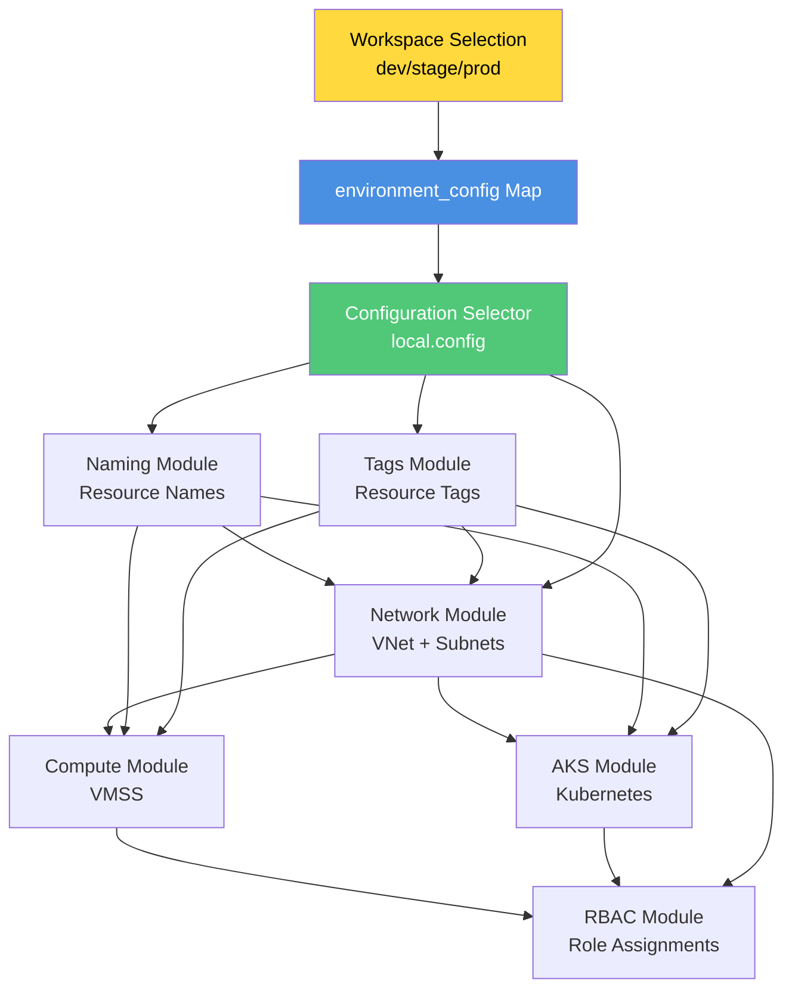
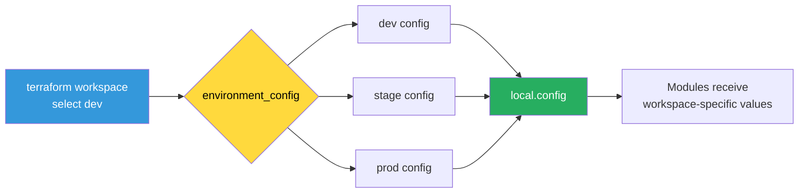
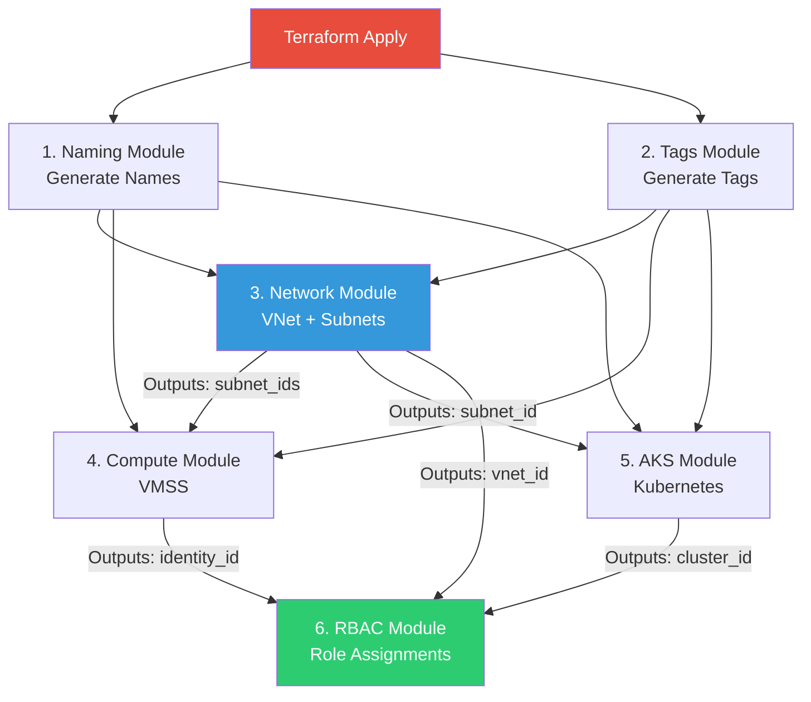

# Environments - Root Orchestration

Root orchestration layer that composes all modules with workspace-driven configuration.

## Overview

This is the **execution entry point** for the platform. It orchestrates all modules (naming, tags, network, compute, AKS, RBAC) with workspace-specific configuration.

## Architecture



## Workspace-Driven Configuration Pattern



## Module Execution Order



## Configuration Map Structure

```hcl
locals {
  environment_config = {
    dev = {
      location                = "East US"
      vnet_address_space      = ["10.0.0.0/16"]
      aks_subnet_prefixes     = ["10.0.1.0/24"]
      compute_subnet_prefixes = ["10.0.2.0/24"]
      aks_node_count          = 1
      aks_node_vm_size        = "Standard_B2s"
      vmss_instance_count     = 1
      vm_sku                  = "Standard_B1s"
      enable_autoscaling      = false
      min_node_count          = 1
      max_node_count          = 3
    }
    stage = { ... }
    prod  = { ... }
  }
  
  # Magic line: select config based on workspace
  config = local.environment_config[terraform.workspace]
}
```

## Files

| File | Purpose |
|------|---------|
| `main.tf` | Module orchestration and configuration |
| `variables.tf` | Input variables (project name, SSH key, etc.) |
| `outputs.tf` | Aggregated outputs from all modules |

## Usage

### Prerequisites

1. **Backend Configuration**: Create `backend.hcl`
2. **Variables**: Create `terraform.tfvars`
3. **SSH Key**: Generate SSH key pair

### Workflow

```bash
# Navigate to execution directory
cd environments/root

# Initialize with backend
terraform init -backend-config=../../backend.hcl

# Create workspace
terraform workspace new dev

# Select workspace
terraform workspace select dev

# Plan
terraform plan -var-file=../../terraform.tfvars

# Apply
terraform apply -var-file=../../terraform.tfvars
```

## Workspacecomparison

| Config | Dev | Stage | Prod |
|--------|-----|-------|------|
| **VNet** | 10.0.0.0/16 | 10.1.0.0/16 | 10.2.0.0/16 |
| **AKS Nodes** | 1 × B2s | 2 × D2s_v3 | 3 × D4s_v3 |
| **VMs** | 1 × B1s | 2 × B2s | 3 × D2s_v3 |
| **Autoscaling** | Disabled | 2-5 nodes | 3-10 nodes |

## Adding New Environment

1. Add entry to `environment_config` map in `main.tf`
2. Create workspace: `terraform workspace new qa`
3. Select and apply: `terraform workspace select qa && terraform apply`

## Design Principles

✅ **Single Codebase** - All environments use same modules  
✅ **Workspace Isolation** - Separate state per environment  
✅ **Configuration-Driven** - All differences in config map  
✅ **No Hardcoding** - No environment names in modules  
✅ **Clean Dependencies** - Clear module execution order  
✅ **Centralized Naming** - Uses naming module  
✅ **Standardized Tags** - Uses tags module

## Why This Structure?

- **Scalability**: Add environments without code changes
- **Maintainability**: Change sizing without touching modules
- **Safety**: State isolation prevents cross-environment impact
- **Clarity**: Explicit module dependencies and execution order
