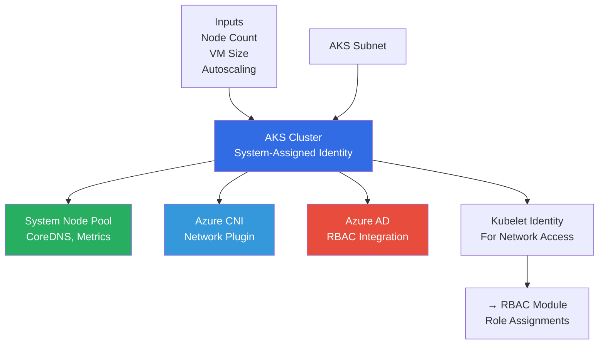
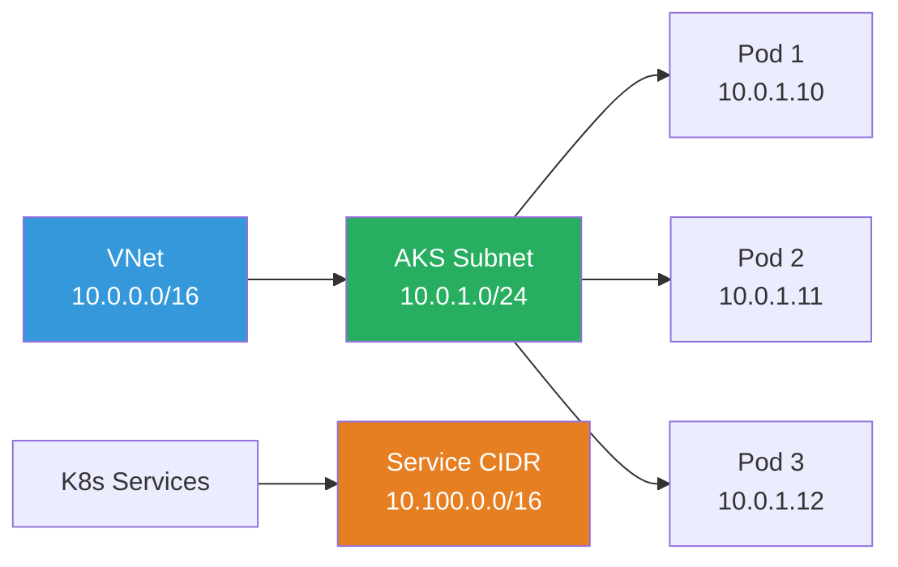
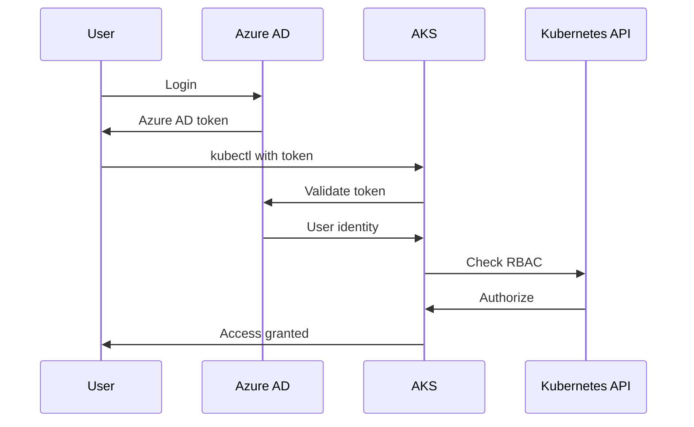

# AKS Module

Azure Kubernetes Service module for provisioning managed Kubernetes clusters with Azure AD RBAC integration.

## Overview

This module provisions a **production-ready AKS cluster** with Azure CNI networking, Azure AD RBAC integration, and support for autoscaling.

## Architecture



## Key Features

| Feature | Configuration | Purpose |
|---------|---------------|---------|
| **Azure CNI** | `network_plugin = "azure"` | Pod gets VNet IP address |
| **Network Policy** | `network_policy = "azure"` | Pod-to-pod traffic control |
| **Azure RBAC** | `azure_rbac_enabled = true` | Azure AD integration |
| **Autoscaling** | Configurable | Scale nodes automatically |
| **System Identity** | System-assigned | Managed identity for AKS |

## Networking Model



## Inputs

| Variable | Type | Description | Example |
|----------|------|-------------|---------|
| `resource_group_name` | string | Resource group name | `azplatform-dev-network-rg` |
| `location` | string | Azure region | `East US` |
| `cluster_name` | string | AKS cluster name | `azplatform-dev-aks` |
| `dns_prefix` | string | DNS prefix for cluster FQDN | `azplatform-dev` |
| `kubernetes_version` | string | Kubernetes version | `1.28` |
| `system_node_count` | number | Initial node count | `1` |
| `system_node_vm_size` | string | Node VM size | `Standard_B2s` |
| `aks_subnet_id` | string | Subnet resource ID | From network module |
| `enable_autoscaling` | bool | Enable autoscaling | `true` |
| `min_node_count` | number | Minimum nodes (autoscale) | `1` |
| `max_node_count` | number | Maximum nodes (autoscale) | `3` |
| `os_disk_size_gb` | number | Node OS disk size | `128` |
| `service_cidr` | string | K8s service CIDR | `10.100.0.0/16` |
| `dns_service_ip` | string | K8s DNS service IP | `10.100.0.10` |
| `admin_group_object_ids` | list(string) | Azure AD admin group IDs | `[]` |
| `tags` | map(string) | Resource tags | `{ Environment = "dev" }` |

## Outputs

| Output | Description | Used By |
|--------|-------------|---------|
| `cluster_id` | Cluster resource ID | RBAC module |
| `cluster_name` | Cluster name | Documentation |
| `kubelet_identity_object_id` | Kubelet identity ID | RBAC module |
| `cluster_fqdn` | Cluster FQDN | kubectl config |

## Usage

```hcl
module "aks" {
  source = "../../modules/aks"
  
  resource_group_name    = module.network.resource_group_name
  location               = module.network.location
  cluster_name           = "azplatform-dev-aks"
  dns_prefix             = "azplatform-dev"
  kubernetes_version     = "1.28"
  system_node_count      = 1
  system_node_vm_size    = "Standard_B2s"
  aks_subnet_id          = module.network.aks_subnet_id
  enable_autoscaling     = false
  min_node_count         = 1
  max_node_count         = 3
  os_disk_size_gb        = 128
  service_cidr           = "10.100.0.0/16"
  dns_service_ip         = "10.100.0.10"
  admin_group_object_ids = []
  tags                   = { Environment = "dev" }
}
```

## Autoscaling Configuration

### Disabled (Fixed Node Count)
```hcl
enable_autoscaling = false
system_node_count  = 2
min_node_count     = null  # Ignored
max_node_count     = null  # Ignored
```

### Enabled (Auto Scale)
```hcl
enable_autoscaling = true
system_node_count  = null  # Ignored
min_node_count    = 2
max_node_count     = 5
```

## Lifecycle Management

```hcl
lifecycle {
  ignore_changes = [
    default_node_pool[0].node_count
  ]
}
```

- Prevents Terraform from reverting manual scaling operations
- Allows autoscaler to manage node count dynamically
- Node count changes won't cause Terraform drift

## Azure AD RBAC Integration



## Network Requirements

- **VNet Integration**: AKS subnet in Azure VNet
- **Service CIDR**: Separate from VNet CIDR (internal K8s services)
- **DNS Service IP**: Must be within service CIDR range
- **No Overlap**: Service CIDR cannot overlap with VNet CIDR

## Design Principles

✅ **Production-Ready** - Azure CNI, RBAC, autoscaling  
✅ **Secure** - Azure AD integration, network policies  
✅ **Scalable** - Autoscaling support  
✅ **Managed** - System-assigned identity  
✅ **Observable** - Lifecycle rules for drift prevention
