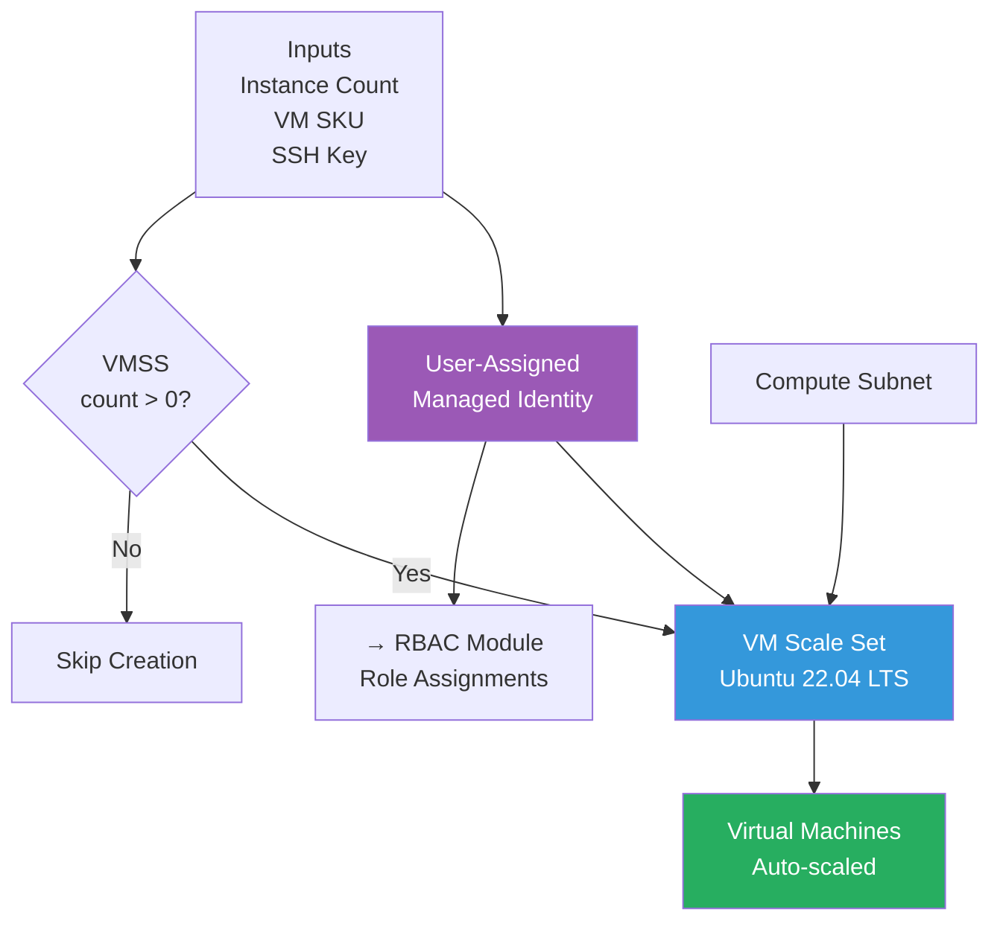
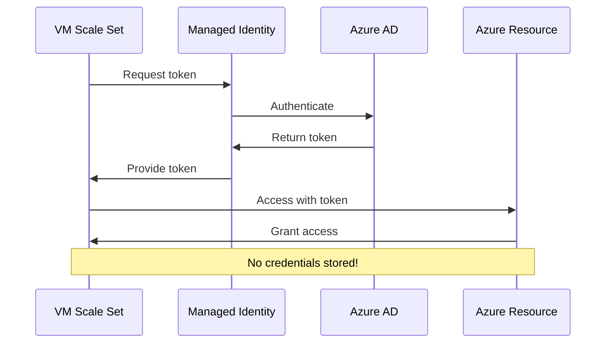

# Compute Module

VM Scale Set module with managed identities for auto-scaling compute workloads.

## Overview

This module provisions **Linux VM Scale Sets** with user-assigned managed identities, providing scalable compute infrastructure without managing credentials.

## Architecture



## Resources Created

| Resource | Purpose | Conditional |
|----------|---------|-------------|
| **User-Assigned Identity** | Azure AD authentication for VMs | Always |
| **VM Scale Set** | Group of auto-scaling Linux VMs | Only if instance count > 0 |

## Managed Identity Flow



## Inputs

| Variable | Type | Description | Example |
|----------|------|-------------|---------|
| `resource_group_name` | string | Resource group name | `azplatform-dev-network-rg` |
| location` | string | Azure region | `East US` |
| `identity_name` | string | Managed identity name | `azplatform-dev-vmss-identity` |
| `vmss_name` | string | VM Scale Set name | `azplatform-dev-vmss` |
| `vm_sku` | string | VM size | `Standard_B1s` |
| `vmss_instance_count` | number | Number of VM instances | `1` |
| `subnet_id` | string | Subnet resource ID | From network module |
| `admin_username` | string | SSH username | `azureuser` |
| `ssh_public_key` | string | SSH public key for auth | Your public key |
| `os_disk_type` | string | Disk storage type | `Premium_LRS` |
| `tags` | map(string) | Resource tags | `{ Environment = "dev" }` |

## Outputs

| Output | Description | Used By |
|--------|-------------|---------|
| `identity_id` | Managed identity resource ID | RBAC module |
| `identity_principal_id` | Managed identity principal ID | RBAC module |
| `vmss_id` | VM Scale Set resource ID | Documentation |

## Usage

```hcl
module "compute" {
  source = "../../modules/compute"
  
  resource_group_name = module.network.resource_group_name
  location            = module.network.location
  identity_name       = "azplatform-dev-vmss-identity"
  vmss_name           = "azplatform-dev-vmss"
  vm_sku              = "Standard_B1s"
  vmss_instance_count = 1
  subnet_id           = module.network.compute_subnet_id
  admin_username      = "azureuser"
  ssh_public_key      = file("~/.ssh/id_rsa.pub")
  os_disk_type        = "Premium_LRS"
  tags                = { Environment = "dev" }
}
```

## VM Image

- **OS**: Ubuntu 22.04 LTS
- **SKU**: `22_04-lts-gen2`
- **Publisher**: Canonical
- **Version**: latest

## Authentication

- **Method**: SSH public key (no passwords)
- **Security**: More secure than password-based auth
- **Management**: Key rotation without VM recreation

## Conditional Creation

```hcl
count = var.vmss_instance_count > 0 ? 1 : 0
```

- If `vmss_instance_count = 0`, no VMSS is created
- Allows disabling compute resources without removing module call
- Useful for cost control in development environments

## Design Principles

✅ **Security** - Managed identities (no stored credentials)  
✅ **Scalability** - VM Scale Sets support auto-scaling  
✅ **Flexibility** - Conditional creation based on instance count  
✅ **Modern Linux** - Ubuntu 22.04 LTS with latest updates

## Why Managed Identities?

- ✅ No credentials in code or configuration
- ✅ Automatic token rotation
- ✅ Azure AD integration
- ✅ Fine-grained permissions via RBAC
