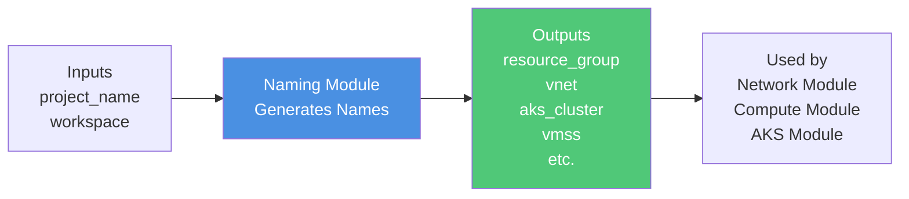

# Naming Module

Centralized resource naming convention module for consistent Azure resource naming across all workspaces.

## Overview

This module generates standardized resource names following the pattern: `{project}-{workspace}-{resource}`

It serves as the **single source of truth** for naming conventions, making it easy to maintain consistency and modify naming patterns globally.

## Architecture



## Naming Pattern

```
{project_name}-{workspace}-{resource_type}
```

**Examples:**
- Resource Group: `azplatform-dev-network-rg`
- VNet: `azplatform-dev-vnet`
- AKS Cluster: `azplatform-dev-aks`
- VMSS: `azplatform-dev-vmss`

## Inputs

| Variable | Type | Description | Validation |
|----------|------|-------------|------------|
| `project_name` | string | Project name prefix | Lowercase letters, numbers, hyphens only |
| `workspace` | string | Current workspace (dev/stage/prod) | None |

## Outputs

| Output | Description | Example Value |
|--------|-------------|---------------|
| `names` | Map of all resource names | See below |
| `base_name` | Base prefix | `azplatform-dev` |
| `resource_group` | Resource group name | `azplatform-dev-network-rg` |
| `vnet` | Virtual network name | `azplatform-dev-vnet` |
| `aks_cluster` | AKS cluster name | `azplatform-dev-aks` |
| `vmss` | VM Scale Set name | `azplatform-dev-vmss` |

### Names Map Structure

```hcl
{
  resource_group = "azplatform-dev-network-rg"
  vnet           = "azplatform-dev-vnet"
  aks_subnet     = "aks-subnet"
  compute_subnet = "compute-subnet"
  vmss           = "azplatform-dev-vmss"
  vmss_identity  = "azplatform-dev-vmss-identity"
  aks_cluster    = "azplatform-dev-aks"
  aks_dns        = "azplatform-dev"
}
```

## Usage

```hcl
module "naming" {
  source = "../../modules/naming"
  
  project_name = "azplatform"
  workspace    = terraform.workspace
}

# Use in other modules
resource_group_name = module.naming.resource_group
vnet_name          = module.naming.vnet
cluster_name       = module.naming.aks_cluster
```

## Benefits

✅ **Consistency** - All resources follow the same naming pattern  
✅ **Maintainability** - Change naming convention in one place  
✅ **Validation** - Built-in validation ensures Azure compatibility  
✅ **Clarity** - Resource names clearly indicate project, environment, and type

## Validation Rules

- Project name must contain only lowercase letters, numbers, and hyphens
- Prevents naming conflicts and Azure resource naming violations
