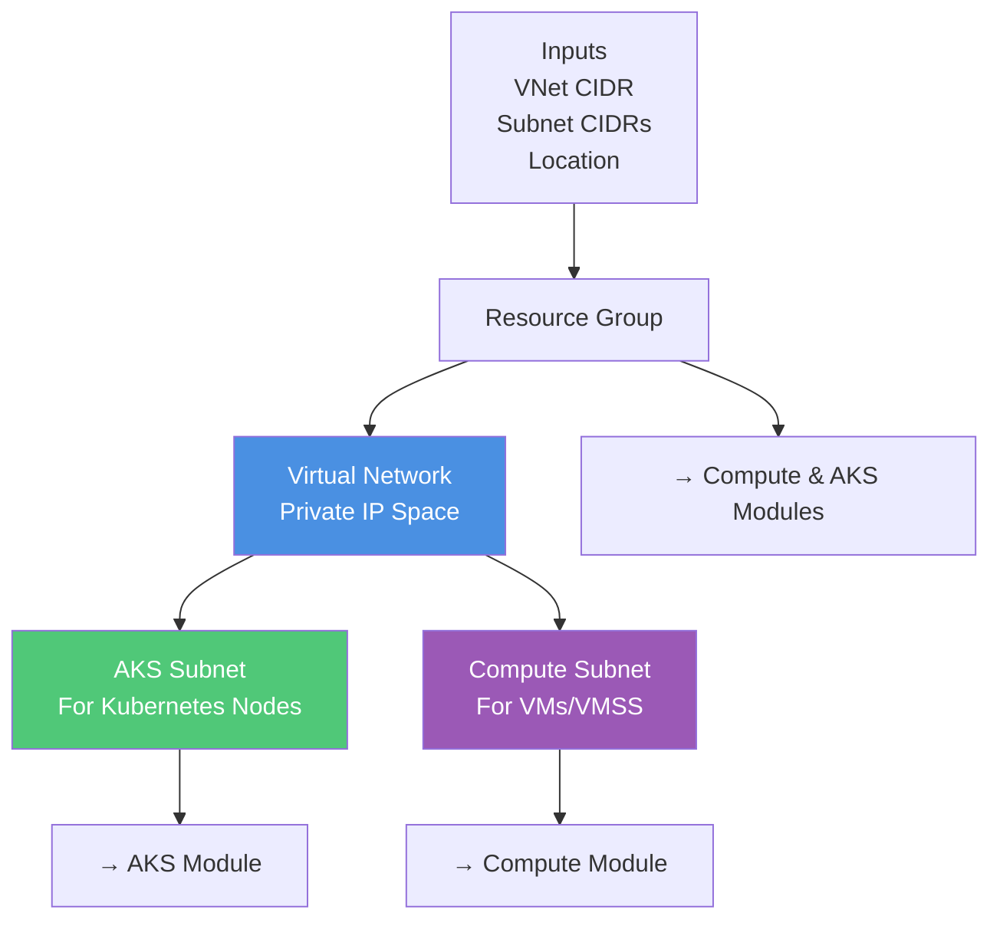
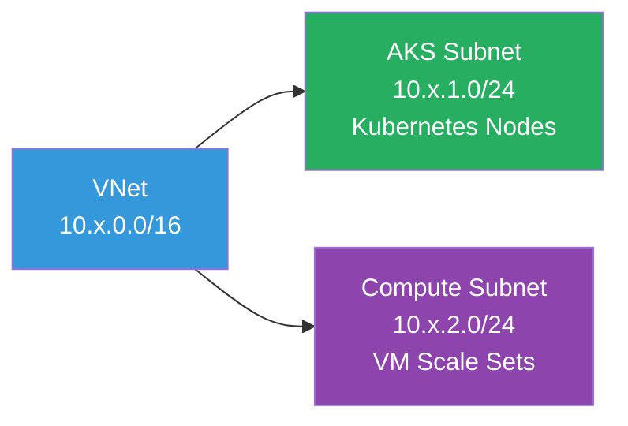

# Network Module

Environment-agnostic Azure networking module that provisions VNet and subnets for AKS and compute workloads.

## Overview

This module creates the **networking foundation** for the platform. It's the first module called because all other modules depend on the network infrastructure it creates.

## Architecture



## Resources Created

| Resource | Purpose |
|----------|---------|
| **Resource Group** | Logical container for network resources |
| **Virtual Network** | Private IP address space |
| **AKS Subnet** | Dedicated subnet for Kubernetes nodes |
| **Compute Subnet** | Dedicated subnet for VMs and VM Scale Sets |

## Network Isolation



## Inputs

| Variable | Type | Description | Example |
|----------|------|-------------|---------|
| `resource_group_name` | string | Name of resource group | `azplatform-dev-network-rg` |
| `location` | string | Azure region | `East US` |
| `vnet_name` | string | Virtual network name | `azplatform-dev-vnet` |
| `vnet_address_space` | list(string) | VNet CIDR blocks | `["10.0.0.0/16"]` |
| `aks_subnet_name` | string | AKS subnet name | `aks-subnet` |
| `aks_subnet_prefixes` | list(string) | AKS subnet CIDR | `["10.0.1.0/24"]` |
| `compute_subnet_name` | string | Compute subnet name | `compute-subnet` |
| `compute_subnet_prefixes` | list(string) | Compute subnet CIDR | `["10.0.2.0/24"]` |
| `tags` | map(string) | Resource tags | `{ Environment = "dev" }` |

## Outputs

| Output | Description | Used By |
|--------|-------------|---------|
| `vnet_id` | Virtual network ID | RBAC module |
| `vnet_name` | Virtual network name | Documentation |
| `resource_group_name` | Resource group name | Compute, AKS modules |
| `location` | Azure region | Compute, AKS modules |
| `aks_subnet_id` | AKS subnet ID | AKS module |
| `compute_subnet_id` | Compute subnet ID | Compute module |

## Usage

```hcl
module "network" {
  source = "../../modules/network"
  
  resource_group_name     = "azplatform-dev-network-rg"
  location                = "East US"
  vnet_name               = "azplatform-dev-vnet"
  vnet_address_space      = ["10.0.0.0/16"]
  aks_subnet_name         = "aks-subnet"
  aks_subnet_prefixes     = ["10.0.1.0/24"]
  compute_subnet_name     = "compute-subnet"
  compute_subnet_prefixes = ["10.0.2.0/24"]
  tags                    = { Environment = "dev" }
}
```

## Design Principles

✅ **Environment-Agnostic** - No hardcoded environment names  
✅ **Separation of Concerns** - Only handles networking, nothing else  
✅ **Reusable** - Can be used for any workspace  
✅ **Clean Outputs** - Provides exactly what downstream modules need

## Why Separate Subnets?

Separate subnets provide:
- **Network segmentation** for security
- **Independent IP management** 
- **Easier network policy** application
- **Clear separation** between Kubernetes and compute workloads
