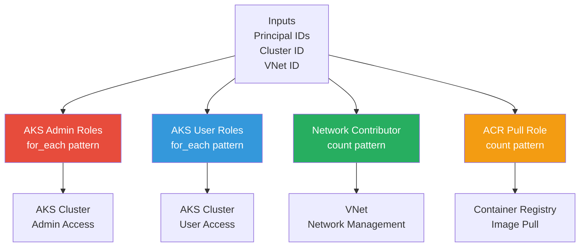

# RBAC Module

Azure Role-Based Access Control module for managing role assignments for AKS and network access.

## Overview

This module manages **Azure AD role assignments** to control who can access AKS clusters and what permissions resources have. It demonstrates advanced Terraform patterns like `for_each` for creating multiple role assignments from a list.

## Architecture



## Role Assignments Created

| Role | Applied To | Purpose | Pattern |
|------|------------|---------|---------|
| **AKS Cluster Admin** | User/Group Principals | Full admin access to AKS | `for_each` |
| **AKS Cluster User** | User/Group Principals | Read-only user access to AKS | `for_each` |
| **Network Contributor** | AKS Kubelet Identity | Manage networking resources | `count` (conditional) |
| **AcrPull** | AKS Kubelet Identity | Pull images from ACR | `count` (conditional) |

## Terraform Patterns Demonstrated

### for_each Pattern
Used for creating multiple role assignments from a list:

```hcl
resource "azurerm_role_assignment" "aks_admin" {
  for_each = toset(var.aks_admin_principal_ids)
  
  scope        = var.aks_cluster_id
  role         = "Azure Kubernetes Service Cluster Admin Role"
  principal_id = each.value
}
```

### count Pattern (Conditional Creation)
Used for optional role assignments:

```hcl
resource "azurerm_role_assignment" "acr_pull" {
  count = var.acr_id != null && var.node_pool_identity_id != null ? 1 : 0
  
  scope        = var.acr_id
  role         = "AcrPull"
  principal_id = var.node_pool_identity_id
}
```

## Inputs

| Variable | Type | Description | Required | Default |
|----------|------|-------------|----------|---------|
| `aks_cluster_id` | string | AKS cluster resource ID | Yes | - |
| `aks_admin_principal_ids` | list(string) | Azure AD principals for admin access | No | `[]` |
| `aks_user_principal_ids` | list(string) | Azure AD principals for user access | No | `[]` |
| `node_pool_identity_id` | string | AKS kubelet managed identity | No | `null` |
| `vnet_id` | string | Virtual network resource ID | Yes | - |
| `acr_id` | string | Container registry resource ID | No | `null` |

## Outputs

None - this module creates role assignments only.

## Usage

```hcl
module "rbac" {
  source = "../../modules/rbac"
  
  # AKS access control
  aks_cluster_id          = module.aks.cluster_id
  aks_admin_principal_ids = [
    "xxxxxxxx-xxxx-xxxx-xxxx-xxxxxxxxxxxx"  # User/Group Object ID
  ]
  aks_user_principal_ids  = [
    "yyyyyyyy-yyyy-yyyy-yyyy-yyyyyyyyyyyy"  # User/Group Object ID
  ]
  
  # Network access for AKS
  node_pool_identity_id = module.aks.kubelet_identity_object_id
  vnet_id               = module.network.vnet_id
  
  # Optional: ACR access
 acr_id = "/subscriptions/.../resourceGroups/.../providers/Microsoft.ContainerRegistry/registries/myacr"
}
```

## Getting Azure AD Principal IDs

```bash
# Get signed-in user ID
az ad signed-in-user show --query id -o tsv

# Get group ID
az ad group show --group "AKS Admins" --query id -o tsv

# Get service principal ID
az ad sp show --id <app-id> --query id -o tsv
```

## Design Principles

✅ **Environment-Agnostic** - No hardcoded environments  
✅ **Flexible** - Supports multiple principals via lists  
✅ **Conditional** - Only creates needed role assignments  
✅ **Clean Separation** - Decoupled from resource creation

## Why Separate RBAC Module?

- **Security Focus** - Access control is a critical concern
- **Reusability** - Can be used with any AKS/network setup
- **Flexibility** - Easy to add/remove role assignments
- **Clarity** - Makes access control explicit and visible
