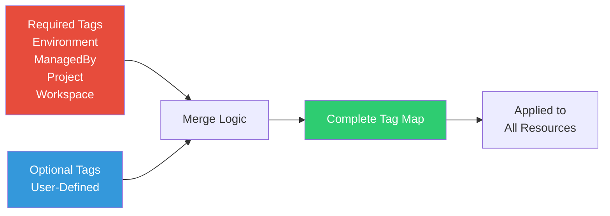

# Tags Module

Standardized resource tagging module for consistent tag management and compliance across all Azure resources.

## Overview

This module generates a standardized set of tags that should be applied to all Azure resources for cost tracking, organization, and compliance.

## Architecture



## Tag Strategy

### Required Tags (Always Applied)

| Tag | Value Source | Purpose |
|-----|--------------|---------|
| `Environment` | workspace | Identifies the environment |
| `ManagedBy` | Fixed: "Terraform" | Shows infrastructure is managed by Terraform |
| `Project` | project_name variable | Groups resources by project |
| `Workspace` | workspace | Tracks which workspace created the resource |

### Optional Tags

Additional tags can be provided via the `additional_tags` variable for custom use cases like:
- Cost Center
- Owner
- Department
- Application

## Inputs

| Variable | Type | Description | Required | Default |
|----------|------|-------------|----------|---------|
| `project_name` | string | Project name | Yes | - |
| `workspace` | string | Current workspace | Yes | - |
| `additional_tags` | map(string) | Custom tags to add | No | `{}` |

## Outputs

| Output | Description |
|--------|-------------|
| `tags` | Complete merged tag map (required + optional) |
| `required_tags` | Only the required tags |

## Usage

### Basic Usage

```hcl
module "tags" {
  source = "../../modules/tags"
  
  project_name = "azplatform"
  workspace    = terraform.workspace
}

# Apply to resources
resource "azurerm_resource_group" "example" {
  name     = "example-rg"
  location = "East US"
  tags     = module.tags.tags
}
```

### With Additional Tags

```hcl
module "tags" {
  source = "../../modules/tags"
  
  project_name = "azplatform"
  workspace    = terraform.workspace
  
  additional_tags = {
    CostCenter  = "Engineering"
    Owner       = "Platform Team"
    Department  = "Infrastructure"
  }
}
```

## Example Output

```hcl
tags = {
  Environment = "dev"
  ManagedBy   = "Terraform"
  Project     = "azplatform"
  Workspace   = "dev"
  CostCenter  = "Engineering"      # If provided
  Owner       = "Platform Team"    # If provided
  Department  = "Infrastructure"   # If provided
}
```

## Merge Behavior

- Required tags are always applied
- Optional tags are merged in
- If there's a conflict, **required tags take precedence**
- This ensures compliance tags cannot be overridden

## Benefits

✅ **Compliance** - Ensures all resources have required tags  
✅ **Cost Tracking** - Enables accurate cost allocation by Environment/Project  
✅ **Organization** - Easy to filter and group resources  
✅ **Flexibility** - Supports additional custom tags  
✅ **Centralized** - Single source of truth for tagging strategy
